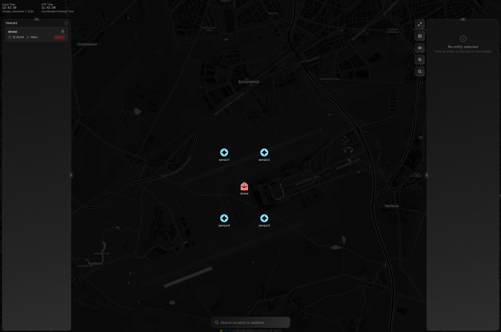

PROJECT-Q HYDRA
===============

Hydra is an open-source tactical coordination machine that connects heterogeneous sensors
and command systems into a unified internet of defense network.
It provides real-time sensor fusion, automated track correlation,
and coordinated response workflows - without replacing your existing systems.



- Sensor Fusion: Correlate tracks from sensors
- Multi-Domain: Single architecture for CUAS, ground surveillance, and maritime awareness
- DDIL-Native: Peer-to-peer mesh continues operating when disconnected
- API-First: Every capability accessible via REST/gRPC; integrate in hours, not months

## Getting Started

Download hydra from https://github.com/projectqai/hydra/releases
and start with `./hydra` and open http://localhost:50051 in the browser.

In `examples/cuas` there's a minimal example of a CUAS scenario, run with `bun examples/cuas/push-entities.ts`.

## CLI Reference

### Main Command

```bash
hydra [flags]
hydra [command]
```

#### Flags

| Flag | Short | Default | Description |
|------|-------|---------|-------------|
| `--port` | `-p` | `50051` | Port to listen on |
| `--view` | | | Open builtin webview in browser |
| `--help` | `-h` | | Help for hydra |

#### Examples

```bash
# Start server on default port 50051
./hydra

# Start server on custom port
./hydra --port 3000

# Start server and open browser automatically
./hydra --view
```

### Subcommands

#### `hydra node`

Run a hydra node (server).

```bash
hydra node [flags]
```

| Flag | Short | Default | Description |
|------|-------|---------|-------------|
| `--port` | `-p` | `50051` | Port to listen on |

#### `hydra ec` (Entity/Components Client)

CLI client for interacting with entities. Aliases: `entities`, `e`

```bash
hydra ec [command] [flags]
```

| Flag | Default | Description |
|------|---------|-------------|
| `--server` | `localhost:50051` | Server address to connect to |

##### `hydra ec ls`

List all entities. Alias: `list`

```bash
./hydra ec ls
./hydra ec ls --server localhost:3000
```

##### `hydra ec debug`

Subscribe to all entity change events and print as JSON. Alias: `d`

```bash
./hydra ec debug
```

##### `hydra ec observe`

Observe entities within a geometry. Alias: `o`

```bash
./hydra ec observe
```

#### `hydra builtins`

Access built-in utilities. Alias: `b`

```bash
hydra builtins [command] [flags]
```

| Flag | Short | Default | Description |
|------|-------|---------|-------------|
| `--server` | `-s` | `localhost:50051` | World server URL |

##### `hydra builtins view`

Serve the embedded web UI.

```bash
./hydra builtins view
```

#### `hydra version`

Print version information.

```bash
./hydra version
```

#### `hydra completion`

Generate shell autocompletion scripts.

```bash
# Bash
./hydra completion bash > /etc/bash_completion.d/hydra

# Zsh
./hydra completion zsh > "${fpath[1]}/_hydra"

# Fish
./hydra completion fish > ~/.config/fish/completions/hydra.fish
```

## Building from Source

### Prerequisites

- **Go 1.25+** - https://go.dev/dl/
- **Bun** - https://bun.sh (for frontend build)
- **Make** - typically pre-installed on macOS/Linux

### Quick Build (Recommended)

Use the Makefile which handles the correct build order:

```bash
make aio
```

This runs:
1. `make gen` - Generate protobuf code (if needed)
2. `make frontend` - Build the frontend (creates `view/frontend/build/`)
3. `go build` - Compile the Go binary with embedded frontend

### Makefile Targets

| Target | Description |
|--------|-------------|
| `make aio` | Full build: generate code, build frontend, compile binary (default) |
| `make frontend` | Build frontend only |
| `make gen` | Generate protobuf code |
| `make android` | Build Android AAR and APK |
| `make clean` | Remove build artifacts |

### Running

```bash
# Start the server (backend + embedded UI)
./hydra

# Start and open browser automatically
./hydra --view
```

Then open http://localhost:50051 in your browser.

## Architecture

See [ARCHITECTURE.md](ARCHITECTURE.md) for detailed documentation of the codebase structure.
